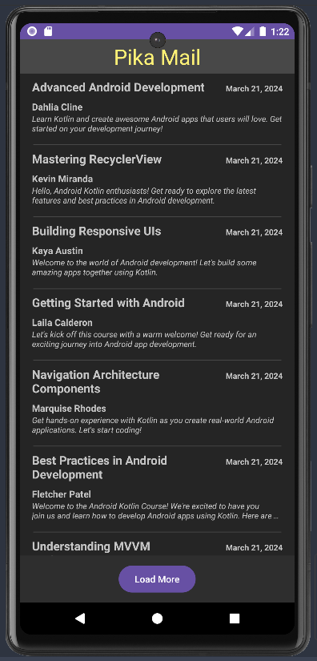

# Lab 2: CodepathMail

#### Time Spent: Around 2 1/2 hours

In this lab, we'll build a simple clone of the very popular Gmail app.

The main purpose of this lab is to understand how to implement the most common type of screen in mobile apps: scrolling lists.

In Android, RecyclerView is what allows us to easily display a list of data, and we'll utilize this lab to get comfortable working with RecyclerViews.

## 🎯 Goals
By the end of this lab you will be able to...

- [ x ] Understand how to display a list of items with RecyclerView
- [ x ] Understand how to customize the UI for each item in the RecyclerView

### Application Features

#### Required Features
- [ x ]  User can scroll through a list of 10 emails
    - Each email includes the following information:
      - Sender 
      - Email title 
      - Email summary
#### Stretch Features

- [ x ] User can press a 'Load More' button to see the next 5 emails displayed
- [ x ] Each email displays additional information:
    - [ ] Picture of the sender
    - [ x ] Email sent date 
    - [ x ] Bolded information if the email is unread

### Resources

- [Create dynamic lists with RecyclerView (developers.android.com)](https://developer.android.com/guide/topics/ui/layout/recyclerview)
- [Using the RecyclerView (CodePath Guide)](https://guides.codepath.com/android/using-the-recyclerview)
  - This guide provides both Java & Kotlin code examples. The Kotlin code (what you need) is just below the Java.